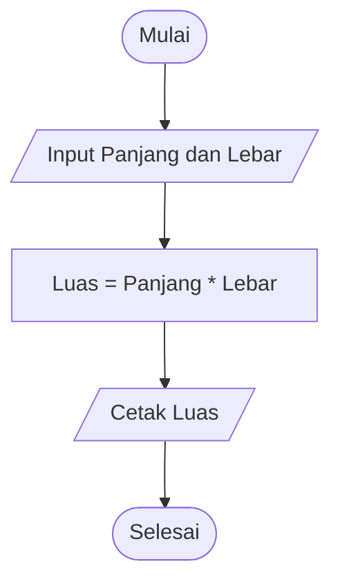

# Percobaan 2 — Flowchart Menghitung Luas Persegi Panjang

Percobaan ini menunjukkan penggunaan flowchart untuk merepresentasikan proses menghitung luas persegi panjang.

---

## Permasalahan

Program menerima:

```text
Panjang
Lebar
```

Kemudian menghitung:

```text
Luas = Panjang * Lebar
```

dan menampilkan hasil perhitungan.

---

## Flowchart



---

## Representasi Teks

```text
Mulai
  |
  v
Input Panjang, Lebar
  |
  v
Luas = Panjang * Lebar
  |
  v
Cetak Luas
  |
  v
Selesai
```

---

## Penjelasan

### 1. Mulai

Program dimulai menggunakan simbol **Terminal**.

### 2. Input

Program menerima nilai:

```text
Panjang
Lebar
```

Bagian ini menggunakan simbol **Input/Output**.

### 3. Proses

Luas dihitung menggunakan:

```text
Luas = Panjang * Lebar
```

Bagian ini menggunakan simbol **Process**.

### 4. Output

Nilai luas ditampilkan kepada pengguna.

Bagian ini menggunakan simbol **Input/Output**.

### 5. Selesai

Program berakhir menggunakan simbol **Terminal**.

---

## Contoh

Diketahui:

```text
Panjang = 8
Lebar   = 5
```

Perhitungan:

```text
Luas = Panjang * Lebar
Luas = 8 * 5
Luas = 40
```

Output:

```text
Luasnya = 40
```

---

## Kesimpulan

Flowchart memungkinkan urutan proses program dilihat secara visual.

Pada kasus ini alurnya bersifat sekuensial karena setiap proses dilakukan secara berurutan tanpa percabangan maupun perulangan.
